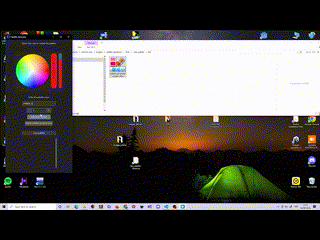
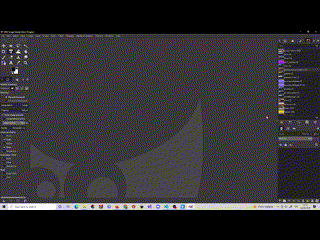

# [:fr:](README_FR.md) [:de:](README_DE.md) [:es:](README.md) 
# Monochromatic Palette Generator

A standalone tool that generates monochromatic color palettes and exports them for use in open-source design software like GIMP, Krita, and Inkscape.

## 🌟 Features
| | | |
|:---:| :---: | :---: | 
|  |  |  |
|* **Custom Color Count:** Easily select the exact number of colors you want in your monochromatic palette.| * **Universal .GPL Export:** Automatically exports your generated palettes in the standard `.gpl` (GIMP Palette) format, making them instantly compatible with GIMP, Krita, and Inkscape. | * **Standalone Application:** No complex installation required. Just run the executable and start generating palettes. |

## 📋 Prerequisites

* **OS:** Windows (to run the `.exe` file).
* **Target Software:** GIMP, Krita, or Inkscape (to use the generated `.gpl` files).

## 🚀 Installation & Usage

1. Download or clone this repository to your local machine:
   ```bash
   git clone [https://github.com/jartibledev/plugin-monochromatic-palette-generator.git](https://github.com/jartibledev/plugin-monochromatic-palette-generator.git)
2. Navigate to the dist directory.
3. Double-click the .exe file to launch the program.
4. (Recommended): For easier access, right-click the .exe file and select Create shortcut, then drag the shortcut to your Desktop.
## 🎨 How to Import Your .GPL Palettes

Once you have generated your `.gpl` file using this program, you can easily import it into your favorite design software:

### In GIMP
1. Open GIMP and go to **Edit > Preferences**.
2. Scroll down the left menu, expand **Folders**, and click on **Palettes**.
3. You will see a list of folder paths. Click on the one that is inside your user directory (usually the top one) to highlight it, then click the **"Show file location in the file manager"** button (the cabinet icon at the top right).
4. Copy your generated `.gpl` file into that folder.
5. In GIMP, open your Palettes dialog (**Windows > Dockable Dialogs > Palettes**) and click the **Configure this tab** icon (the little triangle), then select **Palettes Menu > Refresh Palettes**.

### In Krita
1. Open Krita and go to **Settings > Manage Resources**.
2. Click on **Open Resource Folder**.
3. Open the `palettes` folder and copy your `.gpl` file inside.
4. Restart Krita, or open the Palette Docker (**Settings > Dockers > Palette**), click on the folder icon at the bottom left of the docker, and select your new palette from the list.

### In Inkscape
1. Open your File Explorer.
2. Navigate to Inkscape's custom palettes folder. This is typically located at:
   * **Windows:** `%appdata%\inkscape\palettes`
3. Paste your generated `.gpl` file into this folder.
4. Restart Inkscape. Your new palette will now be available by clicking the small arrow at the extreme right of the color palette bar at the bottom of the screen.
